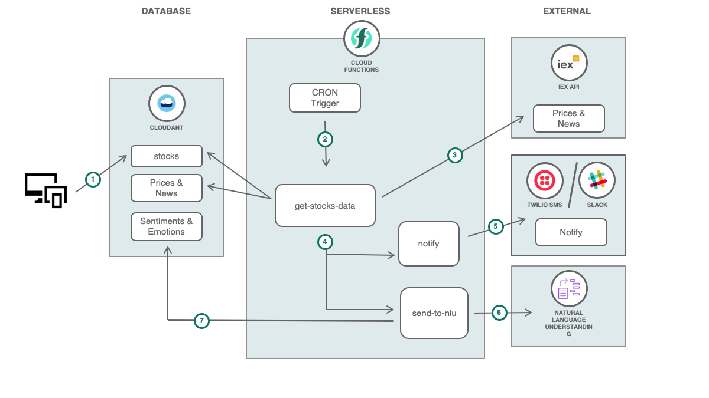
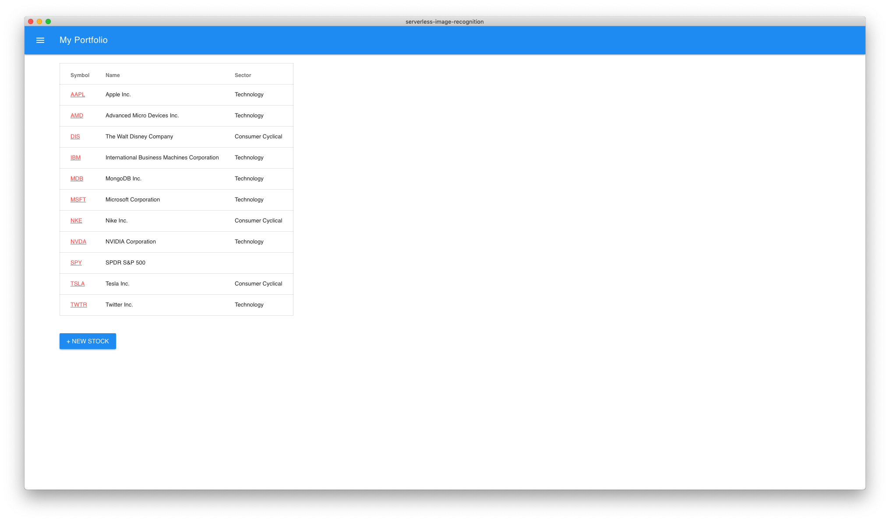
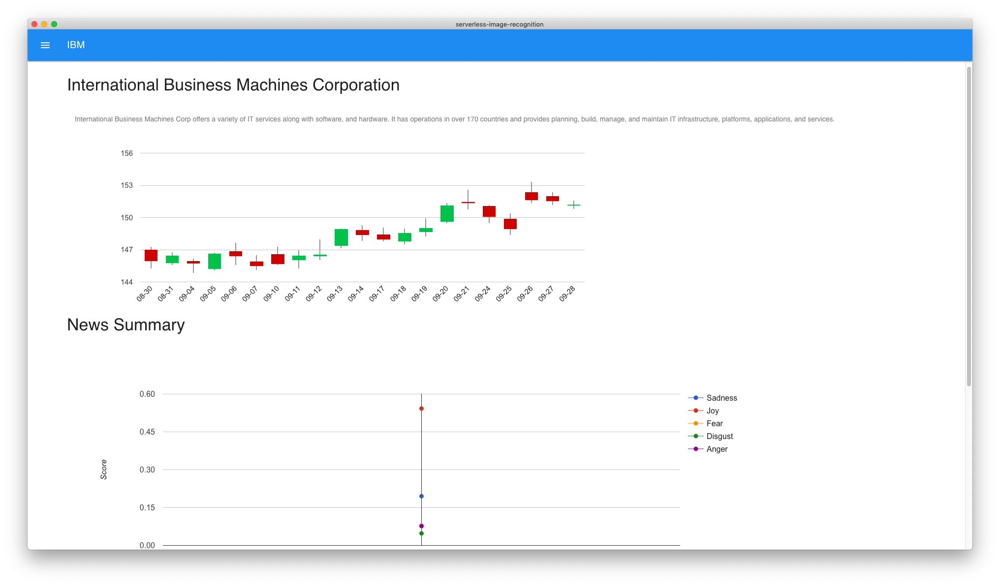

# Run Serverless Functions on data at rest with Stock Market data

The application demonstrates an IBM Cloud Functions (based on Apache OpenWhisk) that does Cron Jobs with data at rest in a Cloudant database. The use case demonstrates how actions work with data services and execute logic at specific times in the Cron job configuration.

One function, or action, is triggered by an event (in this use case, Cron triggers). This action gets data from the database and gets the news and stock market data of the companies from an external API (IEX API). The action invokes 2 more functions. One function passes the news to Watson Natural Language Understanding to get its sentiments and emotions found in the article. The other function notifies the user of the recent change of price in either SMS (Twilio) and/or Slack.

When the reader has completed this Code Pattern, they will understand how to:

* Create and Deploy Cloud Functions
* Trigger Cloud Functions using Cron in Alarm Trigger
* Use Watson NLU in a Cloud Function
* Process data at rest using serverless



## Flow

1. The user enters the Stock ticker he wants to follow.
2. The Alarm Trigger is set on a time-based schedule using cron. It will invoke the action `get-stocks-data` on that time set.
3. The `get-stocks-data` action gets the Stock tickers in the Cloudant and use an external API to get market prices and news about the company.
4. The `get-stocks-data` invokes 2 more actions: the `notify` and `send-to-nlu` actions.
5. The `notify` action sends notification about market changes to the user via SMS or Slack notification.
6. The `send-to-nlu` action sends the news to Watson Natural Language Understanding to get its sentiments and emotions.
7. The sentiments and emotions are stored in the database so it can be viewed by the user.

## Included components

* [IBM Cloud Functions](https://console.ng.bluemix.net/openwhisk) (powered by Apache OpenWhisk): Execute code on demand in a highly scalable, serverless environment.
* [Cloudant](https://console.ng.bluemix.net/catalog/services/cloudant-nosql-db): A fully managed data layer designed for modern web and mobile applications that leverages a flexible JSON schema.
* [Watson Natural Language Understanding](https://www.ibm.com/watson/services/natural-language-understanding/): An IBM Cloud service that can analyze text to extract meta-data from content such as concepts, entities, keywords, categories, sentiment, emotion, relations, semantic roles, using natural language understanding.
* [Twilio](https://console.bluemix.net/catalog/services/twilio-programmable-sms): Integrate voice, messaging, and VoIP into your web and mobile apps.

## Featured technologies

* [Serverless](https://www.ibm.com/cloud-computing/bluemix/openwhisk): An event-action platform that allows you to execute code in response to an event.
* [Node.js](https://nodejs.org/): An open-source JavaScript run-time environment for executing server-side JavaScript code.

# Prerequisites

* [IBM Cloud Functions CLI](https://console.bluemix.net/openwhisk/learn/cli) to create cloud functions from the terminal. Make sure you do the test action `ibmcloud wsk action invoke /whisk.system/utils/echo -p message hello --result` so that your `~/.wskprops` is pointing to the right account.

* [Whisk Deploy _(wskdeploy)_](https://github.com/apache/incubator-openwhisk-wskdeploy) is a utility to help you describe and deploy any part of the OpenWhisk programming model using a Manifest file written in YAML. You'll use it to deploy all the Cloud Function resources using a single command. You can download it from the [releases page](https://github.com/apache/incubator-openwhisk-wskdeploy/releases) and select the appropriate file for your system.

* Install [Node.js](https://nodejs.org/) if you want to use Electron.

# Steps

### 1. Clone the repo

Clone the `ibm-cloud-functions-data-at-rest-processing` locally. In a terminal, run:

```
$ git clone https://github.com/IBM/ibm-cloud-functions-data-at-rest-processing
```

### 2. Create IBM Cloud Services

Create a [**Cloudant**](https://console.bluemix.net/catalog/services/cloudant) instance and choose `Use both legacy credentials and IAM` for the _Available authentication method_ option.
* Create credentials for this instance and copy the username and password in the `local.env` file in the value of `CLOUDANT_USERNAME` and `CLOUDANT_PASSWORD`.
* Launch the Cloudant web console and create a database named `stocks`. You may also want to enable CORS this time for development.

Create a [Watson Natural Language Understanding](https://console.bluemix.net/catalog/services/natural-language-understanding) instance.
* Copy the username and password in the Credentials section and paste it in the `local.env` file in the value of `NLU_USERNAME` and `NLU_PASSWORD`.

### 3. Configure External Services for Notifications

* [Twilio](https://www.twilio.com/sms).
You will need your Twilio Account SID and Auth token. You will also need a Twilio phone number to send SMS. Place these in the `local.env` in the values of `TWILIO_SID`,`TWILIO_AUTH`,`TWILIO_NUMBER`. And also place a number in `NUMBER_OF_RECEIVER` on where to receive the notification.

* [Slack](https://api.slack.com/incoming-webhooks)
You will need an Incoming Webhook in your Slack workspace. Choose to send it to you privately for development.

You can set a threshold for changes in the stock data and only notify you of the stocks that reaches the threshold you set. Place it in the `local.env` file in the value of `THRESHOLD`

### 4. Deploy Cloud Functions

**Choose one of the two deployment methods:**

## Deploy using the `wskdeploy` command line tool

This approach deploy the Cloud Functions with one command driven by the runtime-specific manifest file available in this repository.

Make sure you have the right environment variables in the `local.env` file. Export them in your terminal then deploy the Cloud Functions using `wskdeploy`. This uses the `manifest.yaml` file in this repo's root directory.

```
$ source local.env
$ wskdeploy
```

> You may want to undeploy them later with `wskdeploy undeploy`

## Deploy manually with the `ibmcloud wsk` command line tool

Go to [Alternative Deployment Methods](#alternative-deployment-methods) section

### 5. Launch Application

Configure `web/scripts/cloudantClient.js`. Modify the lines for your Cloudant credentials.

```js
let usernameCloudant = "YOUR_CLOUDANT_USERNAME"
let passwordCloudant = "YOUR_CLOUDANT_PASSWORD"
```

Run the Electron app or open the html file.

* Electron:
```
$ npm install
$ npm start
```

* _(or) Double-click `web/index.html`_

Add the stocks' tickers you want to follow in the webpage. This stores it in Cloudant.

In the `local.env` file, the CRON parameter is set to "16 0 * * *" ([crontab](http://crontab.org) format). It is set to trigger daily at 0:16 UTC (20:16 EDT). You can change this later and do Step 4 again.

To manually fire the trigger, you can do:

```
$ wsk trigger fire cron-trigger
```

This should trigger your actions and receive data from the Stocks you followed.

# Sample output




# Alternative Deployment Methods

### Deploy manually with the `ibmcloud wsk` command line tool

This approach shows you how to deploy individual actions, triggers, and rules with CLI commands. It helps you understand and control the underlying deployment artifacts.

* Export credentials
```
$ source local.env
```

* Create the Alarm Trigger with Cron

The trigger will be fired on a time-based schedule

```
$ ibmcloud wsk trigger create cron-trigger --feed /whisk.system/alarms/alarm \
--param cron $CRON
```

* Create the Actions

Create a package to organize the actions that will be created for this repo.

```
$ ibmcloud wsk package create data-at-rest-processing
```

The action executes your code. The code is in the `actions` folder

Action that gets the stock data from an external API:
```
$ ibmcloud wsk action create data-at-rest-processing/get-stocks-data actions/get-stocks-data.js \
--kind nodejs:8 \
--param USERNAME $CLOUDANT_USERNAME \
--param PASSWORD $CLOUDANT_PASSWORD
```

Action that feeds news to Watson Natural Language Understanding and gets sentiments and emotions.

```
$ ibmcloud wsk action data-at-rest-processing/send-to-nlu actions/send-to-nlu.js \
-- kind nodejs:8 \
--param USERNAME $CLOUDANT_USERNAME \
--param PASSWORD $CLOUDANT_PASSWORD \
--param NLU_USERNAME $NLU_USERNAME \
--param NLU_PASSWORD $NLU_PASSWORD
```

Action that sends an SMS via Twilio and/or a Slack mesage via webhook.

```
$ ibmcloud wsk action data-at-rest-processing/send-to-nlu actions/send-to-nlu.js \
-- kind nodejs:8 \
--param TWILIO_SID $TWILIO_SID \
--param TWILIO_AUTH $TWILIO_AUTH \
--param TWILIO_NUMBER $TWILIO_NUMBER \
--param NUMBER_OF_RECEIVER $NUMBER_OF_RECEIVER \
--param SLACK_WEBHOOK $SLACK_WEBHOOK \
--param THRESHOLD $THRESHOLD \
```

* Create the Rule

The rule will connect the action when the trigger is fired.

```
$ ibmcloud wsk rule create cron-trigger-rule cron-trigger data-at-rest-processing/get-stocks-data
```

You can now proceed to [Launching your application](#5-launch-application).

* To delete them later:

```
$ ibmcloud wsk trigger delete cron-trigger
$ ibmcloud wsk rule delete cron-trigger-rule
$ ibmcloud wsk action delete data-at-rest-processing/get-stock-data
$ ibmcloud wsk action delete data-at-rest-processing/send-to-nlu
$ ibmcloud wsk action delete data-at-rest-processing/notify
$ ibmcloud wsk package delete data-at-rest-processing
```

# Links

* [Apache OpenWhisk](http://openwhisk.incubator.apache.org/): Open source cloud platform that executes functions in response to events at any scale.
* [Node.js Cloudant](https://github.com/cloudant/nodejs-cloudant): Official Cloudant library for Node.js.
* [Watson APIs Node.js SDK](https://github.com/watson-developer-cloud/node-sdk): Node.js client library to use the Watson APIs.

# License
This code pattern is licensed under the Apache Software License, Version 2.  Separate third party code objects invoked within this code pattern are licensed by their respective providers pursuant to their own separate licenses. Contributions are subject to the [Developer Certificate of Origin, Version 1.1 (DCO)](https://developercertificate.org/) and the [Apache Software License, Version 2](http://www.apache.org/licenses/LICENSE-2.0.txt).

[Apache Software License (ASL) FAQ](http://www.apache.org/foundation/license-faq.html#WhatDoesItMEAN)